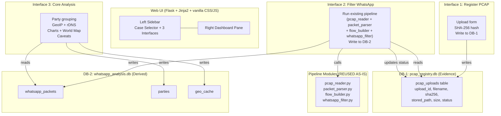

# Comprehensive Implementation Plan: Forensic WhatsApp Analyzer

## Goal

Two parallel overhauls delivered as a single coordinated plan:

- **Part A**: Forensic-grade filtering (6 improvements) + hierarchical 5-level session grouping
- **Part B**: Forensic-analyst web UI - sidebar/dashboard layout, two-DB architecture, 3 pipeline interfaces

Both parts share the same backend modules and databases.

---

## Architecture Overview



---

## Open Questions

> [!IMPORTANT]
> **Q1: Clean rebuild vs. migration** - The new UI replaces the existing webapp entirely (`src/webapp/`). The old `app.py`, templates, and `style.css` will be replaced. The old single `whatsapp.db` is split into two files. Is a clean break acceptable, or do you need the old UI preserved alongside the new one?

> [!IMPORTANT]
> **Q2: Entity-level party aggregation** - The new grouping will collapse 24 parties (one per ephemeral port) into ~3 entities (DNS server, WhatsApp messaging server, etc.). For your NoFilters_record.pcap, the 23 DNS flows to `213.57.22.5:53` become a single party. Confirm this is the desired behavior.

> [!IMPORTANT]
> **Q3: OS timeouts** - Default to Android (600s) since we cannot reliably fingerprint the OS from your captures?

---

## File Layout After Implementation

```
src/webapp/
  app.py                  # [REWRITE] New Flask app with all routes
  db_registry.py          # [NEW]     DB-1 helpers (pcap_registry.db)
  db_analysis.py          # [NEW]     DB-2 helpers (whatsapp_analysis.db)
  static/
    style.css             # [REWRITE] Dark forensic theme
    app.js                # [NEW]     Sidebar state logic (vanilla JS)
  templates/
    layout.html           # [NEW]     Base template: sidebar + dashboard shell
    interface1.html        # [NEW]     Register PCAP (upload + receipt)
    interface2.html        # [NEW]     Filter WhatsApp (run pipeline + status)
    interface3.html        # [NEW]     Core Analysis (charts + map + table)

src/
  whatsapp_filter.py      # [MODIFY]  Add port matching, SNI sub-activity,
                          #           VoIP bitrate, STUN signal, burst media
  packet_parser.py        # [MODIFY]  Add is_stun_binding field
  flow_builder.py         # [MODIFY]  Accept OS-aware timeout
  party_grouper.py        # [REWRITE] 5-level hierarchical grouping
  pipeline.py             # [MODIFY]  Wire new filter signals, new media guesser
  geo_plot.py             # [MODIFY]  Include sub_activity + caveats in hover
  geo_mapping.py          # (no change)
  geolocation.py          # (no change)
  pcap_reader.py          # (no change - reused as-is)
  db.py                   # [DEPRECATE] Replaced by db_registry.py + db_analysis.py
```

---

## Phase 1: Two-DB Architecture + Shared Layout

### 1.1 DB-1: Evidence Registry

#### [NEW] [db_registry.py](file:///c:/Users/ASUS/Desktop/ntro/Whatsapp/src/webapp/db_registry.py)

```python
# Schema for pcap_registry.db
CREATE TABLE IF NOT EXISTS pcap_uploads (
    upload_id TEXT PRIMARY KEY,      -- UUID
    filename TEXT NOT NULL,          -- original filename
    stored_path TEXT NOT NULL,       -- absolute path on disk
    sha256_hash TEXT NOT NULL,       -- SHA-256 of file contents
    size_bytes INTEGER NOT NULL,
    uploaded_at TEXT NOT NULL,       -- ISO 8601 timestamp
    status TEXT NOT NULL DEFAULT 'registered'
    -- status values: 'registered' -> 'filtered' -> 'analyzed'
);
```

Functions: `init_registry_db()`, `register_upload(file, path) -> upload_id`, `get_upload(upload_id)`, `list_uploads()`, `update_status(upload_id, status)`.

The SHA-256 is computed at upload time by streaming the saved file through `hashlib.sha256()`.

---

### 1.2 DB-2: Derived Analysis

#### [NEW] [db_analysis.py](file:///c:/Users/ASUS/Desktop/ntro/Whatsapp/src/webapp/db_analysis.py)

```python
# Schema for whatsapp_analysis.db
# Table 1: classified packets
CREATE TABLE IF NOT EXISTS whatsapp_packets (
    id INTEGER PRIMARY KEY AUTOINCREMENT,
    upload_id TEXT NOT NULL,          -- links to DB-1 via application code
    packet_no INTEGER NOT NULL,
    timestamp REAL NOT NULL,
    src_ip TEXT NOT NULL,
    dst_ip TEXT NOT NULL,
    src_port INTEGER,
    dst_port INTEGER,
    protocol TEXT,
    length INTEGER,
    flow_id TEXT NOT NULL,
    whatsapp_confidence TEXT NOT NULL,
    whatsapp_media_guess TEXT,
    sub_activity TEXT                 -- NEW: from SNI pattern
);

# Table 2: grouped parties (entity-level)
CREATE TABLE IF NOT EXISTS parties (
    party_id TEXT PRIMARY KEY,
    upload_id TEXT NOT NULL,
    remote_ip TEXT NOT NULL,         -- the server/peer IP
    remote_port INTEGER,
    protocol TEXT NOT NULL,
    local_ips TEXT,                  -- comma-separated local IPs
    packet_count INTEGER NOT NULL,
    total_bytes INTEGER NOT NULL,
    first_seen REAL NOT NULL,
    last_seen REAL NOT NULL,
    party_type TEXT NOT NULL,       -- client_to_server, peer_to_peer, unknown
    sub_activity TEXT,              -- chat_control, photo_audio, video, etc.
    confidence TEXT                 -- high, medium
);

# Table 3: geo cache (shared across uploads)
CREATE TABLE IF NOT EXISTS geo_cache (
    ip TEXT PRIMARY KEY,
    country TEXT, city TEXT,
    latitude REAL, longitude REAL,
    asn TEXT, asn_org TEXT,
    looked_up_at REAL,
    rdns_hostname TEXT
);
```

Functions: `init_analysis_db()`, `insert_whatsapp_packets(upload_id, packets)`, `insert_parties(upload_id, parties)`, `get_packets(upload_id)`, `get_parties(upload_id)`.

> [!NOTE]
> The two DBs are **separate SQLite files**: `pcap_registry.db` and `whatsapp_analysis.db`. They are joined in application code via `upload_id`, never by DB-level foreign key. This is intentional forensic convention - DB-1 is write-once evidence, DB-2 is recomputable derived data.

---

### 1.3 Shared Two-Pane Layout

#### [NEW] [layout.html](file:///c:/Users/ASUS/Desktop/ntro/Whatsapp/src/webapp/templates/layout.html)

The base template establishes the persistent sidebar + dashboard structure:

```
+------------------------------+------------------------------------------+
| SIDEBAR (280px fixed)        | DASHBOARD (flex: 1)                      |
|                              |                                          |
| [Case Selector Dropdown]     |                     |
|   -- list of DB-1 entries    |    (content changes per interface)       |
|                              |                            |
| [1] Register PCAP            |                                          |
|   (always enabled)           |                                          |
|                              |                                          |
| [2] Filter WhatsApp          |                                          |
|   (disabled until status     |                                          |
|    >= 'registered')          |                                          |
|                              |                                          |
| [3] Core Analysis            |                                          |
|   (disabled until status     |                                          |
|    >= 'filtered')            |                                          |
|                              |                                          |
+------------------------------+------------------------------------------+
```

CSS: dark charcoal `#1e1e1e` background, off-white `#e0e0e0` text, monospace `'JetBrains Mono', 'Fira Code', 'Consolas', monospace` for IPs/hashes, accent `#4fc3f7` (cool blue) for interactive elements, `#ff6b6b` for warnings/caveats. No gradients, no animations.

---

### 1.4 Dark Forensic CSS

#### [REWRITE] [style.css](file:///c:/Users/ASUS/Desktop/ntro/Whatsapp/src/webapp/static/style.css)

Design tokens:

| Token | Value | Usage |
|---|---|---|
| `--bg-primary` | `#1e1e1e` | Main background |
| `--bg-sidebar` | `#252525` | Sidebar panel |
| `--bg-card` | `#2d2d2d` | Dashboard cards |
| `--bg-table-row` | `#333333` | Alternating table rows |
| `--text-primary` | `#e0e0e0` | Body text |
| `--text-secondary` | `#999999` | Labels, captions |
| `--text-mono` | `#c0c0c0` | IP addresses, hashes |
| `--accent` | `#4fc3f7` | Links, buttons, active states |
| `--accent-hover` | `#81d4fa` | Hover states |
| `--warning` | `#ff6b6b` | VPN/CGNAT caveats |
| `--warning-bg` | `#3d2020` | Warning row highlight |
| `--success` | `#66bb6a` | Status badges: filtered/analyzed |
| `--border` | `#444444` | Dividers, table borders |
| `--font-sans` | `'Inter', 'Segoe UI', sans-serif` | UI text |
| `--font-mono` | `'Consolas', 'Fira Code', monospace` | Data fields |

Key layout rules:
- `body`: `display: flex; height: 100vh; overflow: hidden; margin: 0;`
- `.sidebar`: `width: 280px; flex-shrink: 0; overflow-y: auto;`
- `.dashboard`: `flex: 1; overflow-y: auto; padding: 24px;`
- `.divider`: `width: 1px; background: var(--border);`

---

## Phase 2: Interface 1 - Register PCAP

#### [NEW] [interface1.html](file:///c:/Users/ASUS/Desktop/ntro/Whatsapp/src/webapp/templates/interface1.html)

**Upload form** (left of dashboard):
- File input accepting `.pcap`, `.pcapng`
- On submit: `POST /api/register`

**Receipt display** (after upload):
- Filename, SHA-256 hash (monospace), file size, upload timestamp
- Status badge: `REGISTERED`
- The receipt is rendered inline in the dashboard pane, not a redirect

**Flask route**: `POST /api/register`
1. Save file to `uploads/` directory
2. Compute SHA-256 by streaming `hashlib.sha256()`
3. Generate `upload_id = uuid4()`
4. Insert row into DB-1 (`pcap_registry.db`)
5. Return JSON `{upload_id, filename, sha256, size, status}`

**Flask route**: `GET /interface/1` or `GET /interface/1?upload_id=<id>`
- Renders the upload form + receipt (if `upload_id` is provided)

---

## Phase 3: Interface 2 - Filter WhatsApp

#### [NEW] [interface2.html](file:///c:/Users/ASUS/Desktop/ntro/Whatsapp/src/webapp/templates/interface2.html)

**Pre-condition**: Sidebar disables this link until a case with status `registered` is selected.

**Dashboard content**:
- Shows the selected case's metadata (filename, hash, size)
- "Run Filter" button
- After filtering: summary stats (total packets parsed, flows built, WhatsApp packets classified)
- Table of classified flows with confidence, media type, sub-activity

**Flask route**: `POST /api/filter/<upload_id>`
1. Read `stored_path` from DB-1
2. Call the existing pipeline modules:
   - `pcap_reader.read_packets(stored_path)`
   - `packet_parser.parse_packet()` for each
   - `flow_builder.rebuild_flows()` with OS-aware timeout
   - `whatsapp_filter` classification cascade (enhanced with new signals)
3. Insert classified packets into DB-2 `whatsapp_packets` table
4. Update DB-1 status to `'filtered'`
5. Return JSON summary

**Flask route**: `GET /interface/2?upload_id=<id>`
- Renders the filter dashboard for the selected case

---

## Phase 4: Interface 3 - Core Analysis

#### [NEW] [interface3.html](file:///c:/Users/ASUS/Desktop/ntro/Whatsapp/src/webapp/templates/interface3.html)

**Pre-condition**: Sidebar disables this link until a case with status `filtered` is selected.

**Dashboard content** (all three rendered on the same page):

1. **Party Table** - grouped by entity-level key (remote IP + port + protocol), with columns:
   - Remote IP (monospace), Port, Protocol, Packet Count, Total Bytes, Party Type, Sub-Activity, Confidence
   - Caveat column in `--warning` color when VPN/CGNAT detected

2. **Packet Distribution Chart** - interactive Plotly bar chart showing packet count per party, colored by party_type

3. **World Map** - interactive Plotly Scattergeo:
   - One point per unique geolocated IP (deduplicated)
   - Directed lines from src to dst where both have coordinates
   - Points colored by party_type
   - Hover text includes: IP, city/country, ASN, rDNS hostname, sub_activity, and any caveats
   - VPN/CGNAT caveats rendered as amber markers or annotations

**Flask route**: `POST /api/analyze/<upload_id>`
1. Read packets from DB-2 for `upload_id`
2. Run entity-level grouping (new `party_grouper.py`)
3. Geolocate each party's remote IP
4. Compute caveats
5. Insert parties into DB-2
6. Update DB-1 status to `'analyzed'`

**Flask route**: `GET /interface/3?upload_id=<id>`
- Renders the full analysis dashboard

---

## Phase 5: Enhanced Filtering (Part A)

> [!NOTE]
> These changes are wired into the Interface 2 pipeline call. The existing modules are **modified**, not replaced.

### 5.1 Subdomain SNI Segregation

#### [MODIFY] [whatsapp_filter.py](file:///c:/Users/ASUS/Desktop/ntro/Whatsapp/src/whatsapp_filter.py)

- Add `SNI_ACTIVITY_PATTERNS` dict mapping regex patterns to sub-activity tags
- Update `check_domain_matching()` to return `(confidence, signals, sub_activity)` instead of `(confidence, signals)`
- Pattern map:

| SNI Pattern | Sub-Activity Tag |
|---|---|
| `cX.whatsapp.net`, `dX.whatsapp.net`, `eX.whatsapp.net` | `chat_control` |
| `mmiXYZ.whatsapp.net`, `mmsXYZ.whatsapp.net` | `photo_audio` |
| `mmvXYZ.whatsapp.net` | `video` |
| `media*.whatsapp.net` | `media_generic` |
| `graph.whatsapp.com` | `graph_api` |

### 5.2 Port-Based Validation

#### [MODIFY] [whatsapp_filter.py](file:///c:/Users/ASUS/Desktop/ntro/Whatsapp/src/whatsapp_filter.py)

- Add `check_port_matching(src_port, dst_port)` returning `(confidence, signals, port_activity)`
- WhatsApp chat ports: `{5222, 5223, 5228, 4244, 5242}` -> `"high"` confidence
- STUN ports: `{3478}` -> `"medium"` confidence
- HTTPS port: `{443}` -> `"low"` confidence

### 5.3 STUN Packet Signature

#### [MODIFY] [packet_parser.py](file:///c:/Users/ASUS/Desktop/ntro/Whatsapp/src/packet_parser.py)

- Add `is_stun_binding` field to the packet record (default `False`)
- Detect: UDP packet with frame size 86 bytes AND/OR STUN magic cookie `0x2112A442` at UDP payload bytes 4-7

### 5.4 VoIP Bitrate Detection

#### [MODIFY] [whatsapp_filter.py](file:///c:/Users/ASUS/Desktop/ntro/Whatsapp/src/whatsapp_filter.py)

- Add `detect_voip_by_bitrate(packets)` using 5-second sliding window
- Threshold: sustained > 12 kbps = `voice_call`, mean < 8 kbps = `call_signaling`

### 5.5 Burst-Based Media Guessing

#### [MODIFY] [whatsapp_filter.py](file:///c:/Users/ASUS/Desktop/ntro/Whatsapp/src/whatsapp_filter.py)

- Refactor `guess_media_type()` to accept full packet list instead of just counts
- Add `extract_bursts(packets, threshold=1.0)` helper
- Use burst_intensity (max_burst_bytes / flow_duration) ratio instead of raw byte thresholds
- Prioritize SNI sub-activity hint when available

### 5.6 OS Fingerprinting + Adaptive Flow Timeouts

#### [NEW] `src/os_fingerprint.py`

A lightweight passive OS fingerprinter that reads from unencrypted packet headers — no decryption required.

**Priority-ordered detection methods** (applied in this order, first match wins):

| Method | Signal | Confidence | Implementation |
|---|---|---|---|
| 1. IP TTL | TTL=64 -> Linux/Android; TTL=128 -> Windows | Medium | `packet['ip_ttl']` field |
| 2. TCP Window Size | Android: 65535; iOS: 65535 with scale; Windows: 8192 | Medium | `tcp_window_size` field |
| 3. Inactivity gap | Gap ~3min -> iOS; gaps 10/15/24min -> Android | High | Inter-flow gap analysis |
| 4. TLS Cipher Suite order | iOS vs Android JA3-style fingerprint (no crypto needed) | High | ClientHello extension list |
| 5. DNS timing spikes | Synchronized presence-check spikes -> OS-specific | Low | Burst timing pattern |

```python
OS_TIMEOUTS = {
    'ios':     180,   # 3 minutes - aggressive keepalive termination
    'android': 600,   # 10 minutes - conservative step (also 900, 1440)
    'windows': 600,   # 10 minutes
    'unknown': 300,   # 5 minutes - safe middle ground
}

def fingerprint_os(packet_records: list) -> str:
    """
    Passively fingerprints the device OS from packet metadata.
    Returns: 'ios', 'android', 'windows', or 'unknown'
    """
    # Method 1: TTL-based (fastest, from raw packet headers)
    ttls = [p.get('ip_ttl') for p in packet_records if p.get('ip_ttl')]
    if ttls:
        dominant_ttl = Counter(ttls).most_common(1)[0][0]
        if dominant_ttl == 128:
            return 'windows'
        # TTL 64 means Linux/Android/iOS - need further signals

    # Method 2: Inter-flow inactivity gap (most reliable for WhatsApp)
    # Sort by timestamp and look for gaps matching known timeout values
    timestamps = sorted(p['timestamp'] for p in packet_records if p.get('timestamp'))
    if len(timestamps) > 1:
        gaps = [timestamps[i+1] - timestamps[i] for i in range(len(timestamps)-1)]
        max_gap = max(gaps)
        if 150 <= max_gap <= 210:    # ~3 minutes -> iOS
            return 'ios'
        elif 550 <= max_gap <= 650:  # ~10 minutes -> Android
            return 'android'
        elif 850 <= max_gap <= 950:  # ~15 minutes -> Android
            return 'android'

    # Method 3: TLS cipher suite fingerprint from ClientHello
    # (extracted during packet_parser SNI extraction - reuse is_tls flag)
    tls_packets = [p for p in packet_records if p.get('is_tls') and p.get('sni')]
    if tls_packets:
        # iOS sends GREASE values; Android typically does not
        # This is a simplified heuristic; full JA3 requires cipher suite list
        pass  # Placeholder for future TLS fingerprint extraction

    return 'unknown'
```

**Impact on `packet_parser.py`**: Add `ip_ttl` field extraction from IPv4 header byte 8 (`raw_frame[offset + 8]`). This is a one-liner with zero risk to existing logic.

---

## Phase 6: Hierarchical Party Grouping (Part A)

#### [REWRITE] [party_grouper.py](file:///c:/Users/ASUS/Desktop/ntro/Whatsapp/src/party_grouper.py)

5-level aggregation replacing the current strict 5-tuple grouping:

**Level 1 - Transport Flows**: Already computed by `flow_builder.py`. No change.

**Level 2 - Entity Aggregation** (the key fix):
```python
def get_entity_key(packet):
    """Group by (remote_ip, remote_port, protocol), ignoring ephemeral source port."""
    WELL_KNOWN_PORTS = {443, 53, 80, 5222, 5223, 5228, 4244, 5242, 3478}
    if packet['dst_port'] in WELL_KNOWN_PORTS:
        return (packet['dst_ip'], packet['dst_port'], packet['protocol'])
    elif packet['src_port'] in WELL_KNOWN_PORTS:
        return (packet['src_ip'], packet['src_port'], packet['protocol'])
    else:
        # Neither well-known: normalize by IP ordering
        if packet['src_ip'] < packet['dst_ip']:
            return (packet['dst_ip'], packet['dst_port'], packet['protocol'])
        else:
            return (packet['src_ip'], packet['src_port'], packet['protocol'])
```

**Expected result for NoFilters_record.pcap**:

| Before (5-tuple) | After (entity-level) |
|---|---|
| 24 parties | ~3 entities |
| 23x `10.0.2.15:ephemeral -> 213.57.22.5:53 UDP` | 1x `213.57.22.5:53 UDP` (DNS) |
| 1x `10.0.2.15:49024 -> 157.240.214.60:443 TCP` | 1x `157.240.214.60:443 TCP` (WhatsApp) |

**Level 3 - Session Linking**: TLS session ID extraction (nice-to-have; falls back to entity key if unavailable).

**Level 4 - Behavioral Termination**: Uses the OS-aware timeout from Level 1/flow_builder.

**Level 5 - Burst Partitioning**: Within each entity group, subdivide by 1-second inter-packet gap for activity identification.

---

## Phase 7: Sidebar State Wiring

#### [NEW] [app.js](file:///c:/Users/ASUS/Desktop/ntro/Whatsapp/src/webapp/static/app.js)

Vanilla JS handling:

1. **Case Selector** (`<select>` dropdown at top of sidebar):
   - Populated from `GET /api/uploads` (returns JSON list from DB-1)
   - On change: updates `?upload_id=` query param and refreshes sidebar state

2. **Interface Button State**:
   - Interface 1 (Register): always enabled
   - Interface 2 (Filter): enabled only when selected case status >= `'registered'`
   - Interface 3 (Analysis): enabled only when selected case status >= `'filtered'`
   - Disabled buttons get `class="disabled"` with `pointer-events: none` and dimmed opacity

3. **Status Badges**: Each sidebar item shows a colored dot:
   - `registered` = white dot
   - `filtered` = accent blue dot
   - `analyzed` = green dot

---

## API Route Summary

| Method | Route | Description | DB |
|---|---|---|---|
| `GET` | `/` | Redirect to `/interface/1` | - |
| `GET` | `/interface/1` | Register PCAP page | - |
| `GET` | `/interface/2?upload_id=X` | Filter WhatsApp page | DB-1 read |
| `GET` | `/interface/3?upload_id=X` | Core Analysis page | DB-2 read |
| `POST` | `/api/register` | Upload + hash + insert DB-1 | DB-1 write |
| `POST` | `/api/filter/<upload_id>` | Run pipeline, insert DB-2 | Both |
| `POST` | `/api/analyze/<upload_id>` | Group parties, geolocate | Both |
| `GET` | `/api/uploads` | List all DB-1 entries (JSON) | DB-1 read |
| `GET` | `/api/upload/<upload_id>` | Single DB-1 entry (JSON) | DB-1 read |
| `GET` | `/api/parties/<upload_id>` | Parties for upload (JSON) | DB-2 read |

---

## Execution Order

| Stage | What | Verify By |
|---|---|---|
| 1 | Create `db_registry.py` + `db_analysis.py` + `layout.html` + `style.css` | Load `/` in browser, see dark two-pane shell |
| 2 | Build Interface 1 (register) | Upload `NoFilters_record.pcap`, see SHA-256 receipt |
| 3 | Build Interface 2 (filter) | Click "Run Filter", see classified packets |
| 4 | Build Interface 3 (analysis) + enhanced grouping | See ~3 parties, world map, caveats |
| 5 | Wire sidebar state across all three | Disable/enable buttons reflect DB-1 status |
| 6 | Screenshot of working dashboard | Visual confirmation of Interface 3 |

---

## Verification Plan

### Automated
```bash
# Unit tests for new filter functions
python -c "from src.whatsapp_filter import check_port_matching; print(check_port_matching(12345, 5222))"
# -> ('high', ['port_chat'], 'chat_signaling')

# Entity grouping collapse
python -c "from src.party_grouper import get_entity_key; ..."
# -> verify 24 parties collapse to ~3

# DB separation
python -c "import sqlite3; sqlite3.connect('pcap_registry.db').execute('SELECT count(1) FROM pcap_uploads')"
python -c "import sqlite3; sqlite3.connect('whatsapp_analysis.db').execute('SELECT count(1) FROM whatsapp_packets')"
```

### Manual
- Upload `NoFilters_record.pcap` through Interface 1
- Run filter through Interface 2
- View analysis in Interface 3
- Confirm party count reduction (24 -> ~3)
- Confirm world map renders with caveats visible
- Confirm sidebar disables correctly at each stage
- **Screenshot the final Interface 3 dashboard**

### Invariant Checks
- `SUM(packet_count)` in parties == total classified packets (no data loss during aggregation)
- DB-1 and DB-2 are separate files on disk
- No modifications to `pcap_reader.py` (reused as-is)
- `flow_builder.py` signature unchanged (only timeout param value changes)
